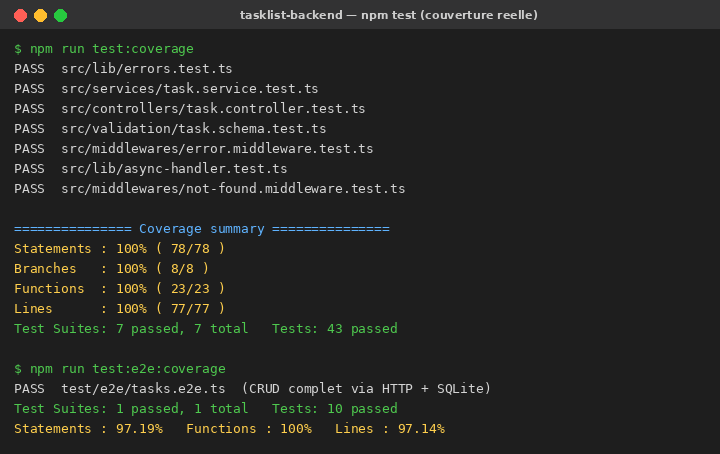

# TaskList — Backend

API backend de l'application **TaskList** (gestion des tâches opérationnelles des employés), construite avec **Node.js, Express, TypeScript et Prisma (MySQL)**. Le dépôt embarque toute la chaîne **CI/CD DevSecOps** : tests + couverture, analyse SonarQube, conteneurisation Docker + Nginx, scan de vulnérabilités Trivy, génération de SBOM et publication sur DockerHub.

[](docs/tests_coverage.png)
[](docs/tests_coverage.png)
[](https://nodejs.org/)
[](https://www.prisma.io/)

---

## Sommaire

1. [Architecture du projet](#1-architecture-du-projet)
2. [API — endpoints](#2-api--endpoints)
3. [Prérequis](#3-prérequis)
4. [Installation des dépendances](#4-installation-des-dépendances)
5. [Tests et couverture](#5-tests-et-couverture)
6. [Analyse SonarQube](#6-analyse-sonarqube)
7. [Construction de l'image Docker](#7-construction-de-limage-docker)
8. [Déploiement avec Nginx (Docker Compose)](#8-déploiement-avec-nginx-docker-compose)
9. [Scan de sécurité (Trivy)](#9-scan-de-sécurité-trivy)
10. [Génération des SBOM](#10-génération-des-sbom)
11. [Publication sur DockerHub](#11-publication-sur-dockerhub)
12. [Pipeline Jenkins](#12-pipeline-jenkins)
13. [Checklist du livrable](#13-checklist-du-livrable)

---

## 1. Architecture du projet

```
tasklist-backend/
├── src/
│   ├── app.ts                 # Construction de l'application Express
│   ├── server.ts              # Point d'entrée (écoute le port)
│   ├── types.ts               # Enums et DTO métier
│   ├── routes/task.routes.ts  # Routes /api/tasks
│   ├── controllers/           # Validation des entrées + réponses HTTP
│   ├── services/              # Logique métier + accès données (Prisma)
│   ├── validation/            # Schémas Zod
│   ├── middlewares/           # Gestion d'erreurs, route inconnue
│   └── lib/                   # prisma (sélecteur de client), erreurs, asyncHandler
├── test/e2e/                  # Tests end-to-end (supertest + SQLite)
├── prisma/
│   ├── schema.prisma          # Schéma de PRODUCTION (MySQL)
│   └── schema-test.prisma     # Schéma de TEST (SQLite, client dédié)
├── Dockerfile                 # Image multi-stage non-root
├── docker-compose.yml         # Stack MySQL + API + Nginx
├── nginx/nginx.conf           # Reverse proxy
├── Jenkinsfile                # Pipeline CI/CD automatisé
├── sonar-project.properties   # Configuration SonarQube
├── jest.config.js             # Tests unitaires
├── jest.e2e.config.js         # Tests e2e
└── docs/tests_coverage.png    # Preuve : tests + couverture
```

| Couche | Rôle |
|--------|------|
| **Controllers** | Valident les entrées (Zod), appellent les services, formatent la réponse. |
| **Services** | Logique métier et accès aux données via Prisma (vérifient l'existence, etc.). |
| **Validation** | Schémas Zod (`createTask`, `updateTask`, `status`, `id`). |
| **Middlewares** | `errorHandler` (traduit `AppError` → HTTP) et `notFoundHandler`. |
| **lib/prisma** | Sélectionne le client Prisma : **MySQL** en production, **SQLite** en test. |

---

## 2. API — endpoints

Modèle `Task` : `id`, `title` (requis), `description`, `status` (`TODO` / `IN_PROGRESS` / `DONE`), `priority` (`LOW` / `MEDIUM` / `HIGH`), `dueDate`, `createdAt`, `updatedAt`.

| Méthode | Endpoint | Description | Codes |
|---------|----------|-------------|-------|
| `GET` | `/health` | Sonde de santé | `200` |
| `GET` | `/api/tasks` | Liste les tâches | `200` |
| `POST` | `/api/tasks` | Crée une tâche | `201`, `400` |
| `GET` | `/api/tasks/:id` | Récupère une tâche | `200`, `400`, `404` |
| `PUT` | `/api/tasks/:id` | Met à jour une tâche | `200`, `400`, `404` |
| `PATCH` | `/api/tasks/:id/status` | Change le statut | `200`, `400`, `404` |
| `DELETE` | `/api/tasks/:id` | Supprime une tâche | `204`, `400`, `404` |

---

## 3. Prérequis

- **Node.js 20+**
- **Docker & Docker Buildx**
- **Trivy** installé localement
- Une instance **SonarQube** (ex. `https://sonarqube.cicd.kits.ext.educentre.fr`) et un token valide
- Un compte **DockerHub** (pour la publication)

---

## 4. Installation des dépendances

```bash
npm ci
npx prisma generate
```

> `npm ci` installe exactement les versions du lockfile. `prisma generate` produit le client Prisma (MySQL) à partir de `prisma/schema.prisma`.

---

## 5. Tests et couverture

Les tests génèrent les **rapports JUnit** (`reports/`) et les **rapports de couverture lcov** (`coverage/`, `coverage-e2e/`) consommés par SonarQube.

```bash
# Client Prisma de test (SQLite)
npx prisma generate --schema=prisma/schema-test.prisma

# Tests unitaires (sans base de données — Prisma est mocké)
npm run test:coverage

# Tests End-to-End (HTTP réel via supertest + base SQLite jetable)
npm run test:e2e:coverage
```



Résultats obtenus :

| Suite | Tests | Branches | Lignes |
|-------|-------|----------|--------|
| Unitaires | **43** | **100 %** | 100 % |
| End-to-End | **10** | 60 % | 97 % |

La couverture **de branches des tests unitaires est de 100 %**, bien au-delà du seuil exigé de **70 %** (le seuil est d'ailleurs **enforced** dans `jest.config.js` via `coverageThreshold`). 

### Stratégie de test

- **Unitaires** : Prisma est entièrement mocké (`jest.mock`), ce qui couvre toutes les branches des services, contrôleurs, validation et middlewares sans base de données.
- **E2E** : une base **SQLite jetable** (générée depuis `schema-test.prisma`) est recréée avant la suite ; `supertest` exécute de vraies requêtes HTTP contre l'application Express (cycle CRUD complet, cas d'erreur 400/404).

---

## 6. Analyse SonarQube

Nécessite un serveur SonarQube et un token valide. La configuration est dans `sonar-project.properties` (sources, tests, exclusions et chemins lcov fusionnés unit + e2e).

```bash
# Installation du scanner (si non global)
npm install -g sonarqube-scanner

sonar-scanner \
  -Dsonar.host.url=https://sonarqube.cicd.kits.ext.educentre.fr \
  -Dsonar.token=XXXXXXXX
```

Le résultat apparaît sur SonarQube ; la **Quality Gate** doit être **PASSED**.

---

## 7. Construction de l'image Docker

L'image est **multi-stage** (compilation TypeScript isolée du runtime), **non-root** (`appuser`), et expose le port `3000`.

```bash
docker buildx build --tag tasklist-backend:local --load .

# Vérifier l'image
docker images
```

---

## 8. Déploiement avec Nginx (Docker Compose)

La stack complète associe **MySQL + API + Nginx** (reverse proxy). C'est ce qui satisfait l'exigence « containerisé avec Nginx ».

```bash
docker compose up -d        # démarre db + api + nginx
docker compose ps           # état des services
```

L'API est accessible via Nginx sur **http://localhost/api/tasks** et **http://localhost/health**.

```bash
# Test rapide
curl http://localhost/api/tasks
curl -X POST -H "Content-Type: application/json" \
  -d '{"title":"Ma première tâche","priority":"HIGH"}' \
  http://localhost/api/tasks
```

Arrêt : `docker compose down` (ajouter `-v` pour supprimer le volume MySQL).

---

## 9. Scan de sécurité (Trivy)

```bash
trivy image --severity CRITICAL,HIGH --format table tasklist-backend:local

# Variante CI : échoue si une CVE CRITICAL/HIGH est trouvée
trivy image --severity CRITICAL,HIGH --exit-code 1 tasklist-backend:local
```

---

## 10. Génération des SBOM

```bash
# Format SPDX
trivy image --format spdx-json --output sbom-spdx.json tasklist-backend:local

# Format CycloneDX
trivy image --format cyclonedx --output sbom-cyclonedx.json tasklist-backend:local

# Inspecter
jq '.packages | length' sbom-spdx.json
```

---

## 11. Publication sur DockerHub

```bash
docker login

# Publication multi-plateforme avec attestation SBOM + provenance
docker buildx build \
  --platform linux/amd64 \
  --tag <VOTRE_USERNAME>/tasklist-backend:latest \
  --sbom=true \
  --provenance=true \
  --push \
  .
```

> Remplacer `<VOTRE_USERNAME>` par votre identifiant DockerHub. L'image devient visible sur `https://hub.docker.com/r/<VOTRE_USERNAME>/tasklist-backend`. Si le compte a été créé via SSO (GitHub/Google), utiliser un **jeton d'accès personnel** comme mot de passe lors du `docker login`.

---

## 12. Pipeline Jenkins

Le `Jenkinsfile` automatise l'enchaînement complet : `Install → Tests + Coverage → SonarQube → Quality Gate → Build image → Trivy → SBOM → Push DockerHub`. Les secrets (token Sonar, identifiants DockerHub) sont injectés via les *credentials* Jenkins, jamais en clair.

---

## 13. Checklist du livrable

- [x] Dépôt forké et cloné
- [x] Installation des dépendances
- [x] Exécution des tests et génération de la couverture
- [x] Tests unitaires écrits
- [x] **≥ 70 % de couverture de branches** sur les tests unitaires (ici **100 %**)
- [ ] Résultat du `sonar-scanner` visible sur SonarQube *(à exécuter sur l'infra SonarQube)*
- [ ] Quality Gate **PASSED** *(à exécuter sur l'infra SonarQube)*
- [x] Application containerisée avec Nginx (`docker-compose.yml` + `nginx/nginx.conf`)
- [ ] Image scannée avec Trivy (CRITICAL/HIGH) *(à exécuter avec Docker)*
- [ ] SBOM produits avec Trivy (SPDX + CycloneDX) *(à exécuter avec Docker)*
- [ ] Image poussée sur DockerHub *(à exécuter avec Docker + compte DockerHub)*

> Les cases non cochées dépendent d'une infrastructure externe (serveur SonarQube, démon Docker, compte DockerHub) : toutes les commandes exactes sont fournies ci-dessus.

---

*Réalisé par BENFDILA Omar — Projet fil rouge TaskList (DevSecOps + Qualimétrie).*
